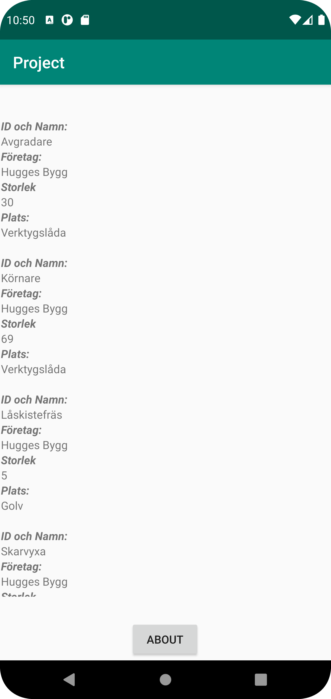
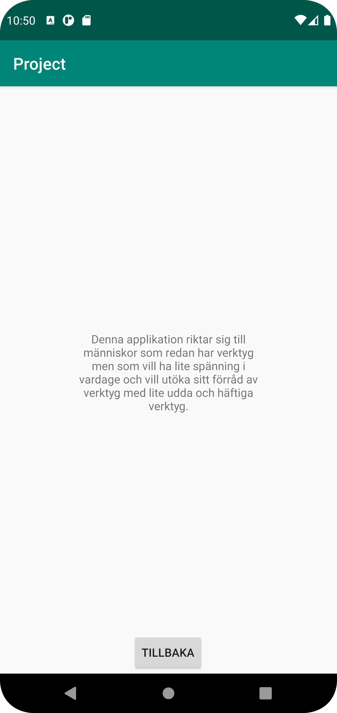

# Rapport

**Skriv din rapport här!**

Jag började med att skapa recyclerview i activity_main.xml och skapade sedan layouten för denna recycler i item_verktyg.xml. Jag deklarerade alla variabler i MainActivty och initerade dem sedan. Jag satte även en intent på den knapp som ligger på startsidan för att användare ska komma till about-sidan. Jag skapade klassen för alla verktyg och lade till getters och setters för varje typ av data jag ville hämta från min egen Json-data. Jag skapade MyViewHolder.java och hittade textview för varje "item" med hjälp av findviewbyid. Jag skapde en adapter som använder setText för att skriva ut datan. Jag skapade en activity för min about-sida med tillhörande xml-fil där det ligger en textview.

```
        recyclerView = findViewById(R.id.recycler_view);
        verktygList = new ArrayList<Verktyg>();
        adapter = new MyAdapter(verktygList);
        recyclerView.setAdapter(adapter);
        recyclerView.setLayoutManager(new LinearLayoutManager(this));
        button = findViewById(R.id.button);

        button.setOnClickListener(new View.OnClickListener() {
            @Override
            public void onClick(View view) {
                Intent intent = new Intent(MainActivity.this, About.class);
                startActivity(intent);
            }
        });
    }
```
Här initieras alla variabler i MainActivity och man kan även se min Intent.

```
    @Override
    public void onBindViewHolder(@NonNull MyViewHolder holder, int position) {
        holder.id.setText(verktyg.get(position).getId());
        holder.name.setText(verktyg.get(position).getName());
        holder.location.setText(verktyg.get(position).getLocation());
        holder.company.setText(verktyg.get(position).getCompany());
        holder.size.setText(String.valueOf(verktyg.get(position).getSize()));
    }
```
I kodstycket ovan kan man se hur adaptern använder setText för att skriva ut datan för varje "item" som jag har i recyclerview.




